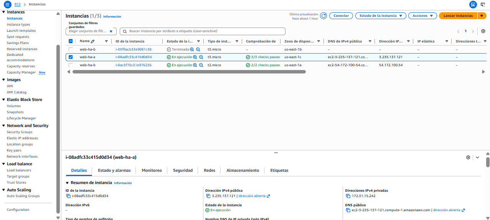
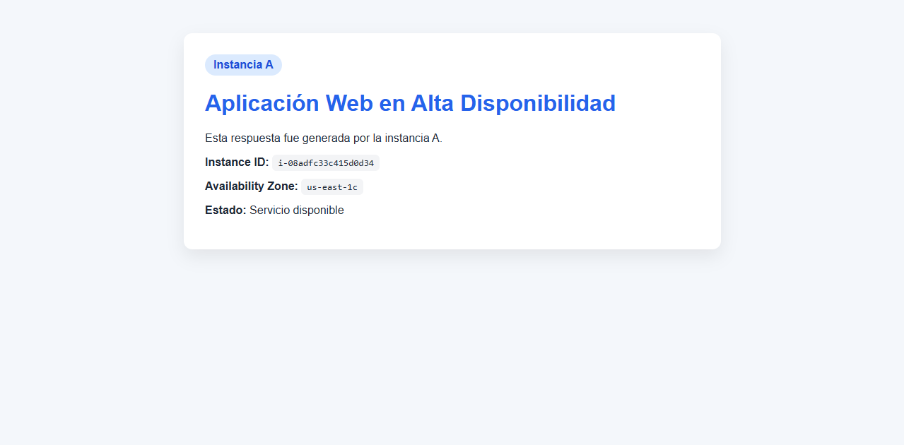
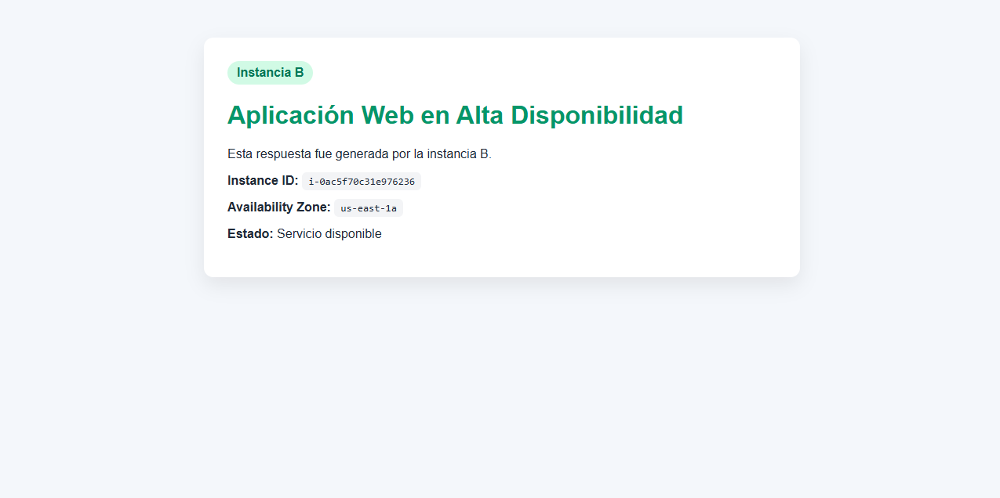
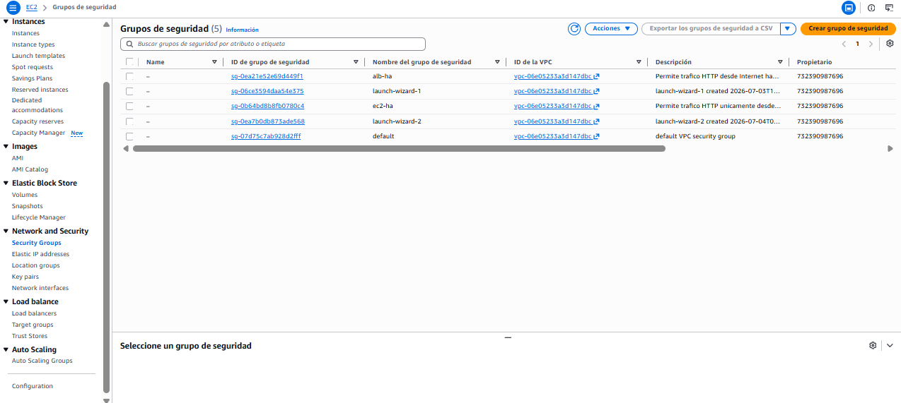
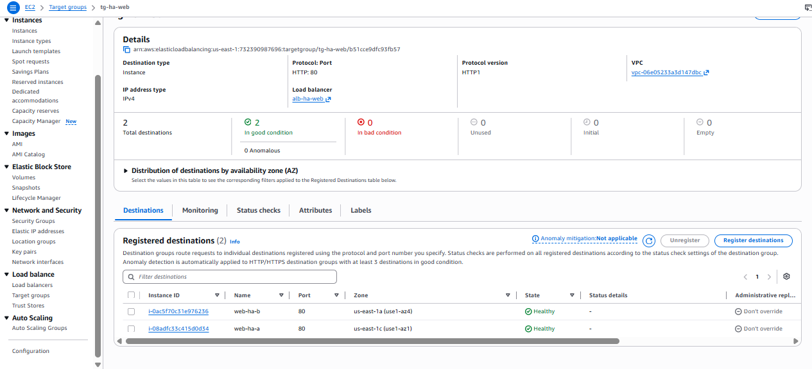
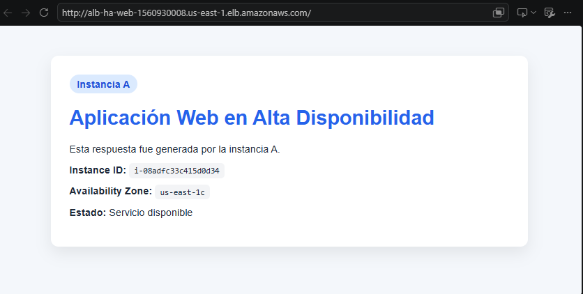
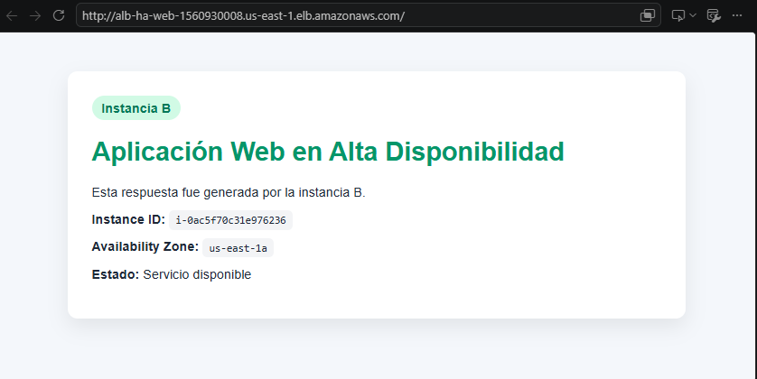
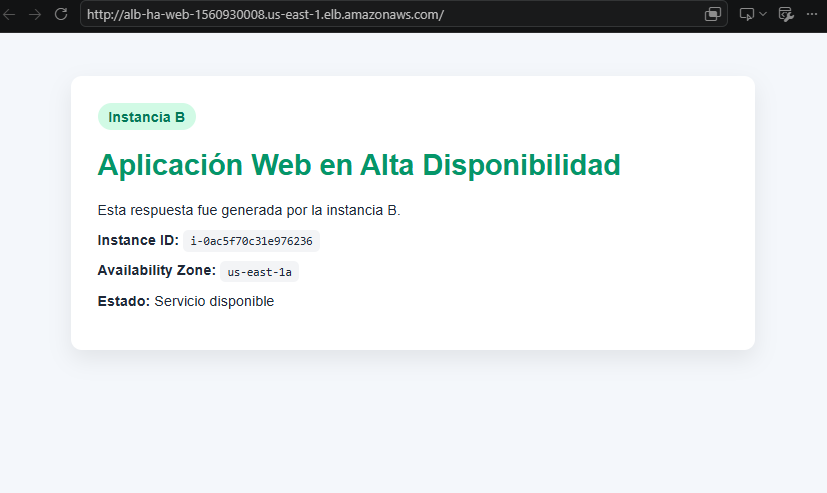
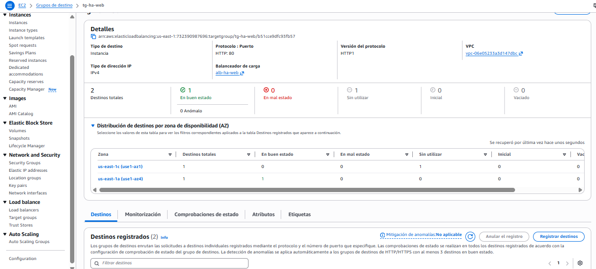

# High-Availability-Load-Balancer-AWS-ARSW
---
## High Availability with Application Load Balancer on AWS


*Author:*  Juan Carlos Bohórquez Monroy

---

## Laboratory Evidence

### Created EC2 Instances



### Instance A - web-ha-a



### Instance B - web-ha-b



### Configured Security Groups



### Target Group - tg-ha-web



### Response from Instance A via ALB



### Response from Instance B via ALB



### Failure Simulation - Only Instance B Responds



### Target Group - Instance A Stopped (Unhealthy)



---

## Activity 1: Load Balancing Analysis

### 1. Which instance responded first?
Instance B responded first, then Instance A when the page was refreshed.

### 2. Did the load balancer alternate between both instances?
Yes, it generated different responses each time the Application Load Balancer DNS was reloaded.

### 3. What information confirms that there is more than one active instance?
The different responses from Instances A and B, since both were configured under the same load balancer and alternated when querying the ALB DNS. Each page displays the Instance ID and the Availability Zone, which allows clear identification of which instance responded.

### 4. What role does the Target Group play?
The Target Group registers the instances as targets, defines the port (80) and protocol (HTTP), and executes health checks to determine which instances are healthy. The Application Load Balancer uses the Target Group to know which instances to send incoming traffic to.

### 5. What role do health checks play?
Health checks are periodic verifications (every 15 seconds to the `/health` path) that confirm the instance responds correctly with code 200. If an instance fails the health check, the ALB automatically stops sending it traffic, maintaining system availability by redirecting requests only to healthy instances.

### 6. Why doesn't the user need to know the public IPs of the instances?
Because the load balancer acts as a **single point of entry** through its public DNS. The user only needs to know the ALB DNS; the ALB internally handles distributing traffic among the instances. This enables:

- **Abstraction**: instances can change (fail, be replaced) without affecting the user.
- **High availability**: if an instance fails, the ALB redirects to another without the user noticing.
- **Load balancing**: the load is automatically distributed among available instances.

---

## Activity 2: Failure Analysis

### 1. What happened when instance A was stopped?
When instance A (web-ha-a) was stopped, the Target Group health check stopped receiving a successful response on the `/health` path. As a result, the Application Load Balancer marked instance A as **Unhealthy** and automatically stopped sending it traffic. Instance A was removed from the available server pool.

### 2. Did the entire system become unavailable?
No. The system remained operational because instance B (web-ha-b) continued to receive and respond to requests. The end user experienced no service interruption, as the ALB redirected all traffic exclusively to the healthy instance.

### 3. What did the Load Balancer do when it detected the failure?
The Application Load Balancer, through the health checks configured in the Target Group, detected that instance A was no longer responding correctly. It automatically removed it from the target group and redirected all incoming traffic exclusively to instance B, which remained healthy.

### 4. What would be different if only one instance existed?
If only one instance existed, when stopped, the entire system would have gone out of service. Users would have received connection errors or timeouts, and the application would not have been available until the instance was manually restarted. The redundancy provided by the second instance prevented this scenario.

### 5. What quality attribute does this architecture improve?
The architecture improves the **availability** of the system. By distributing instances across two different availability zones and using a load balancer with health checks, the system can tolerate the failure of one instance without affecting the user experience. It also improves **resilience** and **fault tolerance**, as the system automatically recovers from component failure without immediate manual intervention.

---

## Activity 3: Recovery Analysis

### 1. What happened when instance A became healthy again?
It was verified again in the Target Group that both instances were in **Healthy** status. The health check confirmed that instance A was responding correctly on the `/health` path, so the ALB automatically reincorporated it into the available server pool.

### 2. Did the load balancer resume sending it traffic?
Yes. Once instance A appeared as **Healthy** in the Target Group, the Application Load Balancer resumed sending requests to it, alternating traffic between both instances again.

### 3. Why is it important that recovery is automatic from the user's perspective?
So that there is no loss of service availability. If an instance goes down, another responds immediately without the user noticing. This guarantees that the application remains accessible at all times, maintaining service continuity without interruptions.

### 4. What limitations does this architecture have if the instance is not manually restarted?
If the instance is not manually restarted, the system would depend solely on a single instance to handle all traffic, losing redundancy and increasing the risk of total failure if that instance also fails. Additionally, it must be verified that when restarting the instance, the health check confirms it as healthy so that the load balancer can reincorporate it into load balancing.

---

## Architectural Validation (Section 24)

| Element | Function in the architecture |
|----------|---------------------------|
| **EC2 instance A** | Runs the Apache web server and hosts the application. Located in an availability zone (us-east-1c) to provide redundancy. Responds to ALB requests when healthy. |
| **EC2 instance B** | Runs the Apache web server and hosts the application. Located in a different availability zone (us-east-1a) to ensure fault tolerance. If instance A fails, B continues serving traffic. |
| **Application Load Balancer** | Single point of entry for users. Receives HTTP requests and distributes them among instances registered in the Target Group, based on health check results. |
| **Target Group** | Groups EC2 instances as load balancer targets. Defines the port (80), protocol (HTTP), and health check configuration to monitor instance status. |
| **Health Check** | Periodic verification (GET /health every 15 seconds) that determines if an instance is available to receive traffic. If it fails, the ALB automatically removes the instance from the pool. |
| **ALB Security Group** | Allows HTTP traffic (port 80) from any source (0.0.0.0/0) to the load balancer, acting as the first security layer. |
| **EC2 Security Group** | Allows HTTP traffic only from the ALB Security Group, isolating instances from direct Internet access and improving security. |
| **Availability Zones** | Allow distributing instances in physically separated locations within the same region. If one zone fails, the instance in the other zone continues operating. |

---

## Activity 4: Improvement Proposal (Section 26)

### How would you add automatic recovery?
By implementing an **Auto Scaling Group** with a Launch Template that automatically launches a new instance when an existing one fails or is marked as Unhealthy. The ASG would integrate with the Target Group to monitor instance status and replace those that don't pass health checks.

### How would you protect instances so they are not public?
By placing EC2 instances in **private subnets** instead of public ones. Only the ALB would be in public subnets. Instances would communicate with the ALB and have Internet egress through a **NAT Gateway** or **NAT Instance** in a public subnet.

### How would you add HTTPS?
By associating an SSL/TLS certificate (from AWS Certificate Manager) with the ALB listener on port 443 and redirecting HTTP (80) traffic to HTTPS. This would encrypt communication between the user and the load balancer.

### How would you record logs and metrics?
By enabling **Access Logs** on the ALB to store logs of all requests in an S3 bucket. Additionally, using **Amazon CloudWatch** to monitor metrics such as latency, number of requests, and target status, with configured alarms to notify about anomalous behaviors.

### How would you handle deployments without downtime?
By implementing **Blue/Green Deployment**, creating a new Target Group with updated instances, then changing the ALB listener rule to point to the new Target Group. **Rolling updates** with Auto Scaling could also be used, updating instances one at a time without affecting availability.

### What components would you add for a highly available database?
I would use **Amazon RDS Multi-AZ**, which automatically replicates the database in another availability zone with automatic failover. For greater scalability, **Amazon ElastiCache** could be added as an in-memory cache to reduce database load.

---

## Final Challenge (Section 27)

### 1. Implemented architecture diagram

```
┌─────────────────────────────┐
│  User / Browser / curl       │
└─────────────────────────────┘
               │
               ▼
┌─────────────────────────────┐
│  Application Load Balancer  │
│  alb-ha-web (Internet-facing)│
│  Public DNS                  │
└─────────────────────────────┘
               │
       ┌───────┴───────┐
       ▼               ▼
┌─────────────┐ ┌─────────────┐
│ EC2 Web A   │ │ EC2 Web B   │
│ web-ha-a    │ │ web-ha-b    │
│ us-east-1c  │ │ us-east-1a  │
│ Apache HTTPD│ │ Apache HTTPD│
│ Private IP  │ │ Private IP  │
└─────────────┘ └─────────────┘
       │               │
       └───────┬───────┘
               ▼
      ┌─────────────────┐
      │ Target Group    │
      │ tg-ha-web       │
      │ Health checks   │
      │ GET /health     │
      └─────────────────┘
```

### 2-6. Evidence screenshots
See **Laboratory Evidence** section at the beginning of this README.

### 7. Simulated failure evidence
See images **Failure Simulation - Only Instance B Responds** and **Target Group - Instance A Stopped (Unhealthy)**.

### 8. Explanation of how the load balancer maintains availability
The Application Load Balancer maintains availability through:
- **Health checks**: periodically verifies that each instance responds correctly on the `/health` path
- **Traffic redirection**: when an instance fails the health check, the ALB automatically stops sending it requests and redirects all traffic to healthy instances
- **Redundancy**: by having instances in two different availability zones, the system tolerates the failure of an entire zone
- **Single point of entry**: the user only interacts with the ALB DNS, without needing to know or manage the IPs of individual instances

### 9. Architecture limitations
- **Manual recovery**: if an instance fails, a new one is not created automatically; it requires manual intervention to restart or replace it
- **No Auto Scaling**: it does not scale automatically in response to increased load
- **No HTTPS**: traffic travels unencrypted (HTTP only)
- **Public instances**: EC2 instances are in public subnets, exposed to the Internet (although protected by Security Groups)
- **No advanced monitoring**: detailed traffic logs and metrics are not recorded
- **No redundant database**: if the application used a database, this would be a single point of failure

### 10. Production improvement proposal
See **Activity 4: Improvement Proposal** above.
